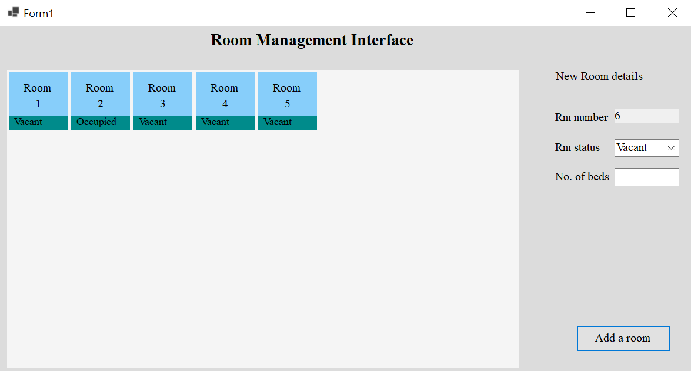
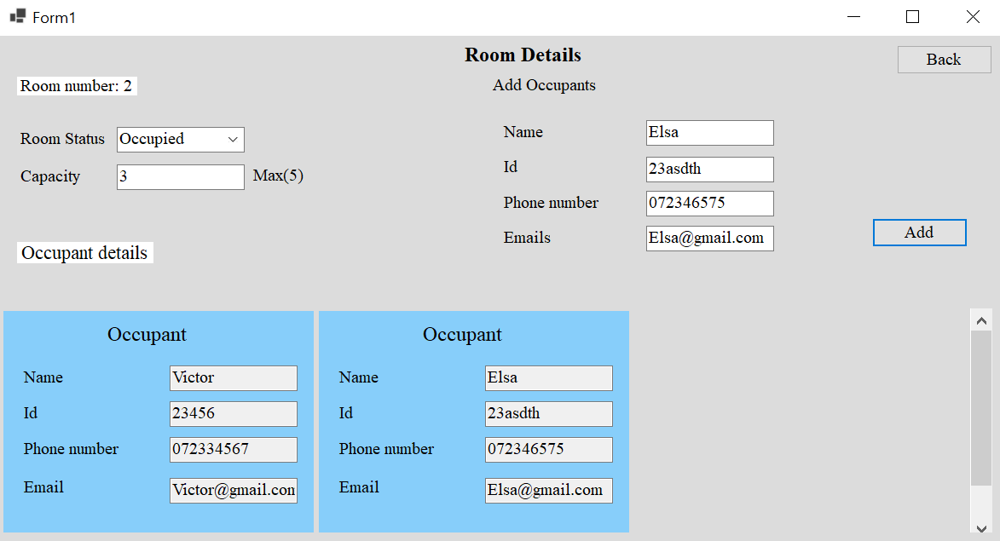

# Room Management Interface using Visual Basic
In this project I've created a basic Room Management Interface which can be used to add rooms and occupants, defining whether the rooms are vacant occupied or under maintenance.

## Overview

